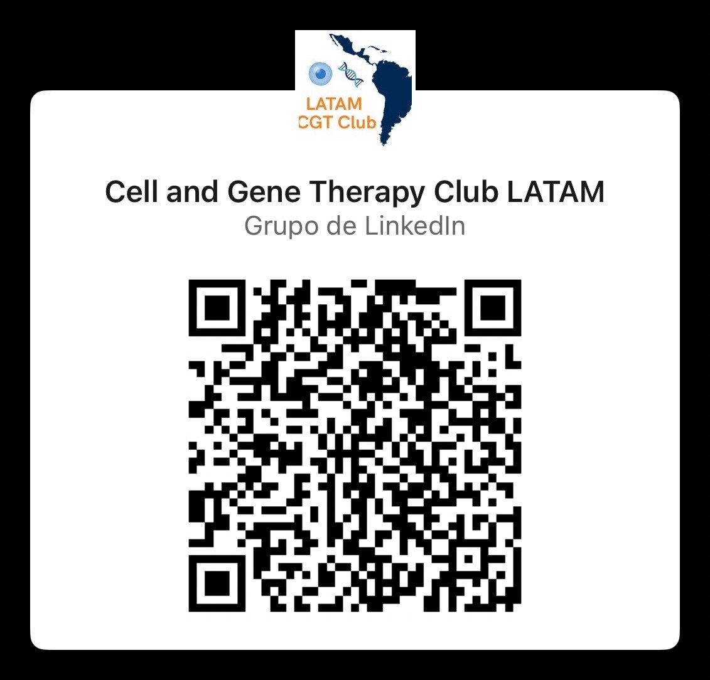

::: {#biosistalks}
:::

::: {style="text-align: justify;"}
## Resumen del ponente

Alissen Haro es una bióloga graduada de la Universidad San Francisco de Quito, Ecuador. Actualmente, se encuentra realizando sus estudios de maestría en Biomedicina Molecular en la Universidad Autónoma de Madrid. Forma parte del equipo Biomedical Discovery de la Universidad San Francisco de Quito, liderado por PhD. Andrés Caicedo. Ha participado en investigaciones sobre el modelamiento de proteínas mitocondriales con mutaciones potencialmente relacionadas con la longevidad celular, y en estudios sobre el uso de mitocondrias como “living drugs” para terapias de regeneración celular.

## Enlace de reunión

[Reunión meet](https://meet.google.com/yri-wpht-kna)

## Información del ponente

<i class="bi bi-linkedin"></i> [Alissen Haro](https://www.linkedin.com/in/alissen-haro-a5b7671b0/)

### Grupo de Investigación

{width="146"}
:::
